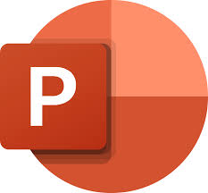

# Microsoft Suite Autogeneration of Documents

With this projects, I want to investigate the feasibility of creating Microsoft Documents using Python. This could save a lot of time for repetitive tasks while using a nice and easy programming language like Python. I will explore the 3 main applications of Microsoft: Word, Excel and Powerpoint.

## Word

blablabla

## Excel

blablabla

## PowerPoint

blablabla

## Resources